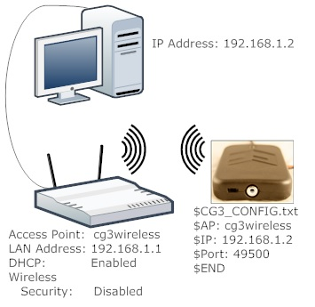

# Wireless connection to CyberGlove III via Python and Wifi

Repository with the code to communicate with and calibrate the CyberGlove III using Python. 

The here published code can be used to establish a connection to the CyberGlove III (Cyberglove Systems LLC, San Jose California, [Homepage](http://www.cyberglovesystems.com "Cyberglove Systems LLC Homepage")). Furthermore, fundamental functions are provided to implement different calibration procedures. The code was developed as part of two Bachelor theses at the Institute of Applied Dynamics at the Friedrich-Alexander-Universität Erlangen-Nürnberg in Germany [^1][^2]. It was mainly used in [^3], with which it was published.


## Prerequisites

The code was developed on a **Windows 10, 64-bit** operating system and with **Python 3.8.10-64bit**.

## Installation

It is recommended to make use of Python's [virtual environment](https://docs.python.org/3/library/venv.html) functionality.

Install all required packages:
```python 
cd code/
pip install -r requirements.txt
```

## Setup

To connect to the CyberGlove via a Wifi network as in the follwowing schematic, the following has to be considered.

| <p align="center">  </p> |
| :--: |
| *Schematic representation of a network consisting of a router, computer and a decive. Figure is taken from the CyberGlove III Quick Start guide[^4].* |

The default port is 49500.
Specify the port in the `glove.py` module to use any other port.^

The WiFi-network’s name (here _cg3wireless_), the static IP address of the computer (here _192.168.1.2_) and the port (here _495000_) need to be written to the text file `CG3_CONFIG.txt` on the flash card of the CyberGlove:

```
$CG3_CONFIG.txt
$AP: cg3wireless
$IP: 192.168.1.2
$PORT: 49500
$END
```

The value of `$AP` is the name of the wireless network, the value of `$IP` is the static IP address of the computer and the value `$PORT` is the opened port of the PC.

It is recommended to set a static IP address for your computer, otherwise you have to check the IP address every time you start your computer and adjust the `CG3_CONFIG.txt` file accordingly.

## Using the glove

All functions are documented in the code using Python docstrings. There is also an example script (`example_glove.py`) to show how the functions can be used to connect to the glove, to query sensor values, and to calculate the calibration parameters.

A calibration procedure has to be set up by oneself, consisting of one (or multiple) instances of capturing the sensor values followed by the calculation of the calibration parameters. 

### Code structure

* In `glove.py`, the class `Glove` is implemented. It provides functionality for communication between the CyberGlove III and the computer in use.

   **NOTE:** There are currently unused functionalities implemented in `glove.py`. They are intended as examples and templates for other functionality of the CyberGlove listed in the CyberGlove III manual [^5].

* In `method_1.py` to `method_3.py` different calibration approaches are implemented.

* In `example_glove.py` an example is given how to connect to the glove, how to get the sensor values for either a single snapshot or a continuous measurement and how to save the readings into a `.txt` file. 


### Querying data

First you have to import the Glove package and create an instance of the class.

```python
from glove import Glove
gl = Glove()
```

Now, switch the glove on, __after__ you created the instance of the class.


Then you can capture a single dataset, a predefined number of data sets or a data set until a key press event is detected.

```python

# measure one dataset #
dataset_1 = gl.get_one_dataset()

# measure 10 datasets continuously with the highest possible frequency #
values = []
for _ in range(10):
	dataset_2 = gl.get_one_dataset()
	values.append(dataset_2)

# measure continuously with the highest possible frequency until key press (enter), save to output.txt #
gl.write_continuous_datasets("output.txt")
```

If you use this code, we would be grateful if you cite it as 
```
@software{PyConnectCG3,
author = {Institute of Applied Dynamics Friedrich-Alexander-Universität Erlangen-Nürnberg},
month = sep,
title = {{PyConnectCG3}},
url = {https://github.com/Institute-of-Applied-Dynamics/PyConnectCG3},
version = {1.0.0},
year = {2023}
}
```
and the associated paper[^3] (the code was published with) as 
```
@article{heinrich2024,
  author   = "Simon Heinrich and Johannes Michaelis and Isabella Reiher and Birte Coppers and Markus Lohmayer and Elisa Fleischmann and Arnd Kleyer and Georg Schett and Ann-Sophie de Craemer and Dirk Elewaut and Sigrid Leyendecker and Anna-Maria Liphardt",
  title    = "Comparison and Improvement of CyberGlove III Calibration Methods",
  journal  = "IEEE Sensors",
  year     = 2024,
  volume   = "",
  number   = "",
  pages    = "",
  doi      = {10.1109/JSEN.2024.3376606},
  comment  = "preprint" 
}
```


## References

[^1]: Michaelis J. "Development of a python-based communication interface for CyberGlove III and comparison of calibration methods", bachelor thesis, Institute of Applied Dynamics --- Friedrich-Alexander-Universität Erlangen-Nürnberg, Germany, 2022
[^2]: Reiher I. "On the advanced calibration of CyberGlove III and its applicability to rheumatic patients", bachelor thesis, Institute of Applied Dynamics --- Friedrich-Alexander-Universität Erlangen-Nürnberg, Germany, 2022
[^3]: Heinrich S, Michaelis J, Reiher I, Coppers B, Lohmayer M, Fleischmann E, Kleyer A, Schett G, de Craemer A-S, Elewaut D, Leyendecker S, Liphardt A-M. "Comparison and Improvement of CyberGlove III Calibration Methods", IEEE Sensors, DOI:[10.1109/JSEN.2024.3376606], *preprint*
[^4]: Cyberglove Systems LLC "CyberGlove III Quick Start", [http://www.cyberglovesystems.com/support](http://www.cyberglovesystems.com/support), 2010
[^5]: Cyberglove Systems LLC "CyberGlove III MOCAP Glove - User and Programmer Guide", [http://www.cyberglovesystems.com/support](http://www.cyberglovesystems.com/support)

